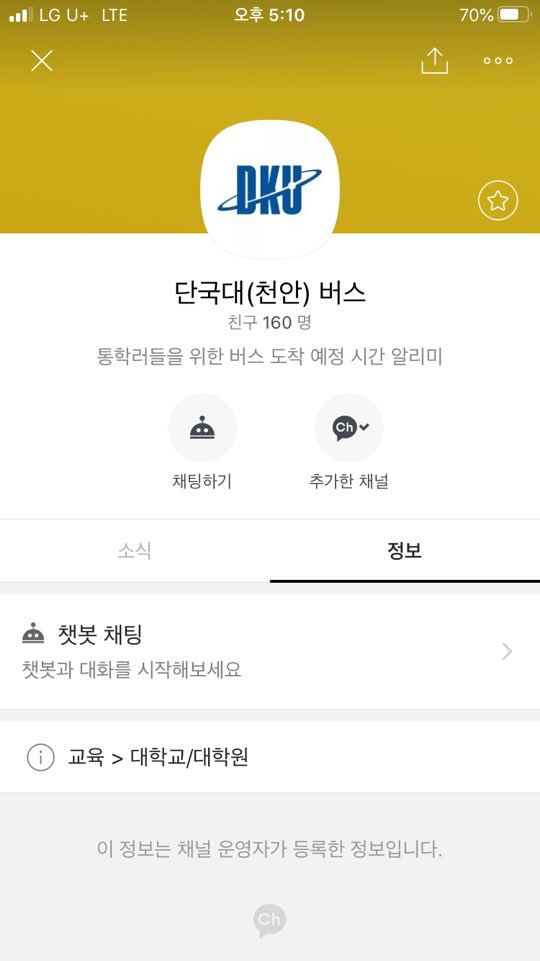
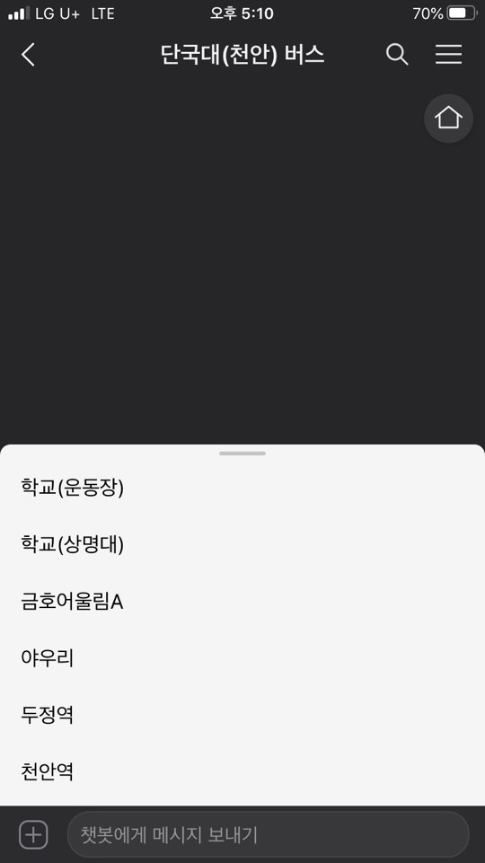
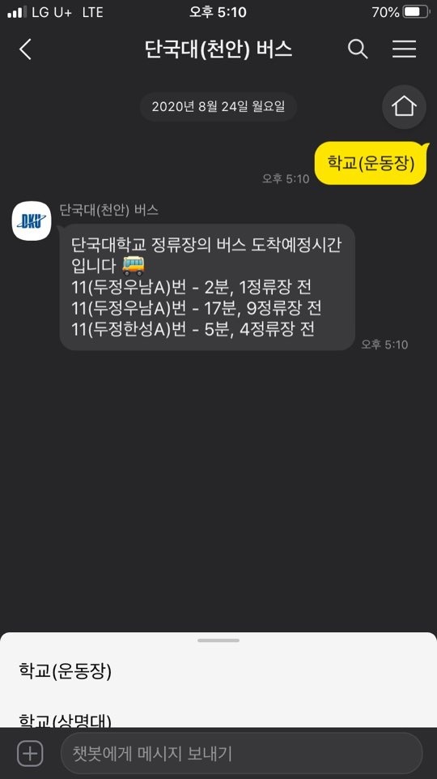

# 단국대학교 버스 도착 정보 알림 챗봇

## Project Summary

지도 어플에 들어가서 버스정류장을 검색한 뒤, 버스 도착 정보를 얻는 기존의 방식에서 카카오톡으로 간단하게 학교 주변 버스정류장의 정보를 얻을 수 있도록 접근성을 높혔습니다

## How to use

카카오톡 검색창에 **'단국대(천안) 버스'** 라고 검색한 뒤, 친구 추가 후 사용하시면 됩니다.

## User Interface

학생들이 자주 이용하는 6개의 정류장에 대해서 정보를 제공하고 있습니다.

버튼을 누르면 해당 정류장의 버스 도착 정보를 받을 수 있습니다.

## Example

버스 번호 + 행선지, 예상 도착 시간, 남은 정류장에 대한 정보를 받을 수 있습니다.

개발자 : 장서원
